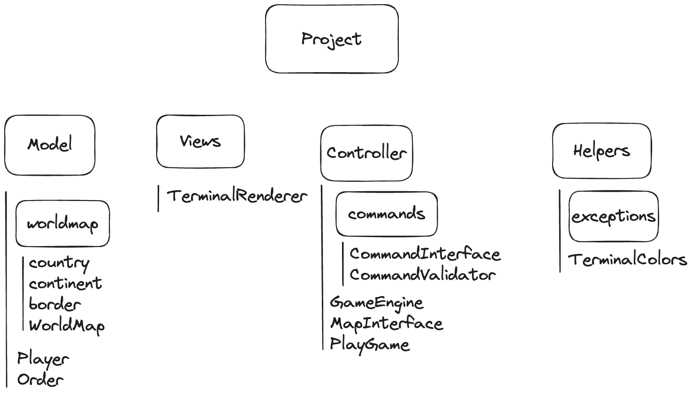
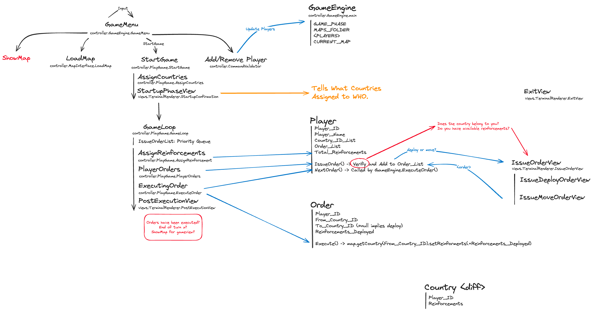

# SOEN6441_Team24_Warzone

# Design and Project

## Naming conventions

- class names in CamelCase that starts with a capital letter
- data members start with d_
- method parameters start with p_
- local variables start with l_
- global variables in capital letters
- static members start with a capital letter, non-static members start with a lower case letter
  Code layout
- consistent layout throughout code (use an IDE auto-formatter)
  Commenting convention
- javadoc comments for every class and method
- long methods (more than 10 lines) are documented with comments for procedural steps
- no commented-out code

## Project structure
- one folder for every module in the high-level design
- tests are in a separate folder that has the exact same structure as the code folder
- 1-1 relationship between tested classes and test classes

## Design To-Do
- [x] Map-Editor
  - [x] User-driven creation/deletion of map elements: country, continent, and connectivity between countries. Map editor commands:
    - [x] editcontinent -add continentID continentvalue -remove continentID 
    - [x] editcountry -add countryID continentID -remove countryID
    - [x] editneighbor -add countryID neighborcountryID -remove countryID neighborcountryID
  - [x] Display the map as text
    - [x] showmap (show all continents and countries and their respective neighbors)
    - [x] Save a map to a text file exactly as edited (using the “domination” game map format). Map editor command:
    savemap filename
    - [x] Load a map from an existing “domination” map file, or create a new map from scratch if the file does not exist. Map editor command: editmap filename
    - [x] The validatemap command can be triggered anytime during map editing. Map editor command: validatemap
      - [x] map is a disconnected graph
      - [x] map contains a continent that is a disconnected subgraph).  
      - [x] <Pending>.
- [x] GameEngine
 - [x] Implementation of a GameEngine class implementing and controlling the game phases according to the Warzone rules.
 - [x] Game Play Command: -  showmap (show all countries and continents, armies on each country, ownership, and connectivity in a way that enables efficient game play)
 - [x] Startup phase
   - [x] Game starts by user selection of a user-saved map file, which loads the map as a connected directed graph. Startup phase command: loadmap filename
   - [x] User creates the players, then all countries are randomly assigned to players. Startup phase commands: gameplayer -add playername -remove playername
   - [x] assigncountries
   - [x] There must be a Player class that must hold (among other things) a list of Country objects that are owned by the Player and a list of Order objects that have been 
         created by the Player during the current turn, and has a method “issue_order()” (no parameters, no return value) whose function is to add an order to the list of 
         orders held by the player when the game engine calls it during the issue orders phase. The player class must also have a “next_order()” (no parameters) method that 
         is called by the GameEngine during the execute orders phase and returns the first order in the player’s list of orders, then removes it from the list
 - [x] Main game loop
  - [x] Loop over each player for the assign reinforcements, issue orders and execute orders main game loop phases
  - [x] Main game loop: assign reinforcements phase: Assign to each player the correct number of reinforcement armies according to the Warzone rules.
  - [x] Main game loop: issue orders phase: The GameEngine class calls the issue_order() method of the Player. This method will wait for the following command, then create a         deploy order object on the player’s list of orders, then reduce the number of armies in the player’s reinforcement pool. The game engine does this for all players in         round-robin fashion until all the players have placed all their reinforcement armies on the map. Issuing order command: deploy countryID num (until all       
        reinforcements have been placed)
  - [x] Main game loop: execute orders phase: The GameEngine calls the next_order() method of the Player. Then the Order object’s execute() method is called, which will     
        enact the order. The effect of a deploy order is to place num armies on the country countryID.
- [x] Programming Process
  - [x] Architectural design—short document including an architectural design diagram. Short but complete and clear description of the design, which should break down the            system into cohesive modules. The architectural design should be reflected in the implementation of well-separated modules and/or folders.
  - [x] Software versioning repository—well-populated history with dozens of commits, distributed evenly among team members, as well as evenly distributed over the time               allocated to the build. A tagged version should have been created for build 1. Use of a continuous integration solution that applies the following operation when             code is pushed onto the repository:
    - (1) project successfully compiles
    - (2) all unit tests successfully pass
    - (3) javadoc is compiled and reported as complete.
  - [x] Javadoc API documentation—completed for all files, all classes and all methods
  - [x] Unit testing framework—at least 10 relevant test cases testing the most important aspects of the code. Must include tests for:
    -  map validation – map is a connected graph;
    -  continent validation – continent is a connected subgraph;
    -  calculation of number of reinforcement armies;
    -  player cannot deploy more armies that there is in their reinforcement pool.
  - [x] Coding standards—Consistent use of the coding conventions described below
  
  ## JUnit compulsory test cases
  - [x] map validation – map is a connected graph 
  - [x] continent validation – continent is a connected subgraph; 
  - [x] calculation of number of reinforcement armies; 
  - [x] player cannot deploy more armies that there is in their reinforcement pool.
  - [x] Assign countries logic sum of assigned countries=total countries, 1 country difference at max
  - [x] load map when game engine has a default map added
  - [x] save map if text file is created or not
  - [x] play game to check if load map is correct or not
  
  ## Refactoring Targets
- [ ] Target 1
- [ ] Target 2
